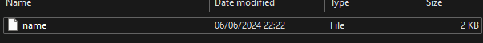
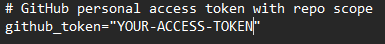
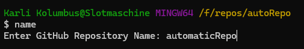

# Create automaticRepo (on hold)
This project allows the user to create a file called **<name>** or anything else. That created file allows the user to initialize a repository in an existing project. Adding a Readme File and then pushing it all to your personal GitHub Account with just one command.


## 🗿 Authors

- [@quentintyr](https://www.github.com/quentintyr)
- Creation Date [06/06/2024](https://www.youtube.com/watch?v=dQw4w9WgXcQ)

## 🛠 Creating the name file
Creating the name file and adding it to git bash allows the user to run the script in bash.exe with just the name of the file without the need to call it everytime you want to use it.

Create a file called **[name]** or anything else, but remove the file extension.

### Copy the following in your file and replace YOUR-USERNAME + YOUR-ACCESS-TOKEN
```
#!/usr/bin/env bash

set -e

reponame="$1"

if [ -z "$reponame" ]; then
    read -p "Enter GitHub Repository Name: " reponame
fi

if [ -z "$reponame" ]; then
    echo "Repository name cannot be empty. Exiting."
    exit 1
fi

# GitHub username or organization name
github_username="YOUR-USERNAME"
# GitHub personal access token with repo scope
github_token="YOUR-ACCESS-TOKEN"

# Create repository on GitHub using GitHub API
curl -X POST -H "Authorization: token $github_token" -d '{"name":"'"$reponame"'"}' "https://api.github.com/user/repos"

# Initialize Git repository
git init

# Create README file
echo "ADD README CONTENT" > README.md

# Add README file to the staging area
git add README.md

# Add all files to the staging area
git add --all

# Commit changes
git commit -m "Initial commit"

# Set the remote origin to the GitHub SSH URL
git remote add origin "git@github.com:$github_username/$reponame.git"

# Rename the default branch from master to main
git branch -m master main

# Push to GitHub, setting upstream to main
git push -u origin main
```

Ensure Execution Permissions:
Make sure the script has execution permissions. If you're using Git Bash or a Unix-like environment, you can use 
```
chmod +x name
```
to grant execution permission, by entering the command in git bash, where the file is saved.

### Add the name file to git bash
```
nano ~/.bashrc
```
Then enter the following to the file:
```
export PATH=$PATH:(your/path/to/file)
```
Example:
```
export PATH=$PATH:/d/scripts
```
## 🌐 Creating an SSH Key & Connection

To generate an SSH key and add it to your GitHub account, follow these steps:

Generate an SSH Key:
Open a terminal window (Command Prompt on Windows or Terminal on macOS/Linux) and run the following command:

```
ssh-keygen -t rsa -b 4096 -C "your_email@example.com"
```

Replace "your_email@example.com" with the email address associated with your GitHub account. Press Enter to accept the default file location (~/.ssh/id_rsa) and leave the passphrase blank if you don't want extra security (or set a passphrase if you prefer).

Add SSH Key to the SSH Agent (optional but recommended):
Start the SSH agent:
```
eval "$(ssh-agent -s)"
```
Then add your SSH key to the agent:

```
ssh-add ~/.ssh/id_rsa
```

Copy the Public Key:
Run the following command to display your public SSH key:
```
cat ~/.ssh/id_rsa.pub
```
Copy the **entire output**.

## 🖇️ Add SSH Key to GitHub

Log in to your GitHub account.

Click on your profile icon in the top-right corner and select "Settings."

In the sidebar, click on "SSH and GPG keys."

Click on "New SSH key" or "Add SSH key."

Paste your public SSH key into the "Key" field.

Give the key a descriptive title (e.g., "create repo").

Click "Add SSH key."

Verify SSH Key Setup:

To ensure everything is set up correctly, you can test your SSH connection to GitHub in bash:
```
ssh -T git@github.com
```
You should see a message confirming your connection.

Once you've completed these steps, your SSH key is added to your GitHub account, and you can use SSH to authenticate when interacting with GitHub repositories, including pushing and pulling code.


## 💎 Create a classic token
Log in to your GitHub account.

Click on your profile icon in the top-right corner and select "Settings."

In the sidebar, click on "Developer Settings<>."

Click on "personal access tokens" and then "Tokens (classic)".

Click "Generate new token (classic)".

Choose your desired expiration date.

Select all "repo" and "write:packages".

Proceed to save the token.

Copy the token and paste it in the file, where "YOUR-ACCESS-TOKEN" is.



## Usage
After you've done the above steps, you can use the command name <reponame> to execute your script or as the following:


The repository will be created on GitHub, a Readme.md and every file in the directory added, committed and pushed to your repo.
If any Issues appear during the process, please let me know so i can try to fix.

